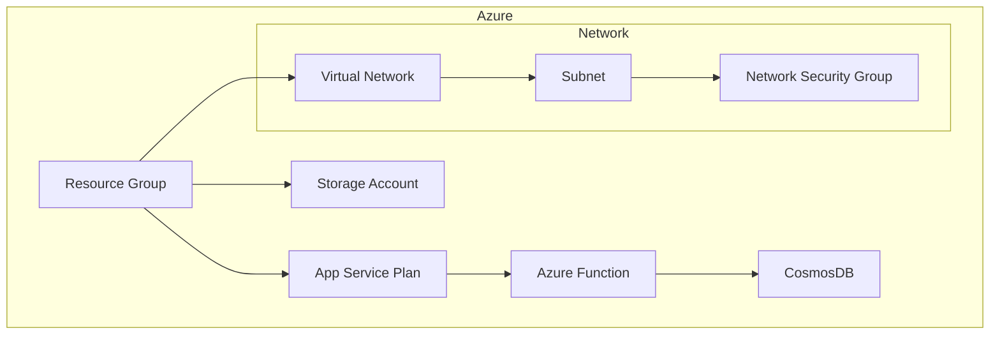

📦 Projeto Terraform – Infraestrutura Azure Serverless

---

Este projeto provisiona uma infraestrutura serverless no Azure utilizando Terraform, de forma modularizada e reutilizável.

🏗️Arquitetura do Projeto

---



🗂️ Estrutura do Projeto

---

```bash
.
├── module
│ ├── Project
│ │ ├── ENVIRONMENT_STEST.tfbackend
│ │ ├── ENVIRONMENT_STEST.tfbackend.EXAMPLE
│ │ ├── ENVIRONMENT_STEST.tfvars
│ │ ├── ENVIRONMENT_STEST.tfvars.EXAMPLE
│ │ ├── main.tf
│ │ └── variables.tf
│ └── infra
│ ├── app_serviceplan.tf
│ ├── cosmosdb.tf
│ ├── function.tf
│ ├── infra_nsg.tf
│ ├── network.tf
│ ├── provider.tf
│ ├── rg.tf
│ ├── storage.tf
│ ├── variables.tf
│ └── vnet.tf
└── tfstate-storage.sh
```

🧩 Organização dos Módulos

---

📂 module/infra

Módulo responsável por criar os recursos Azure:

- Arquivo Função
- provider.tf Provider AzureRM
- rg.tf Resource Group
- vnet.tf Virtual Network
- network.tf Subnets
- infra_nsg.tf Network Security Groups
- storage.tf Storage Account
- app_serviceplan.tf App Service Plan
- function.tf Azure Function
- cosmosdb.tf CosmosDB
- variables.tf Variáveis do módulo

📂 module/Project

Camada de orquestração que chama o módulo infra.

main.tf:

```
module "Project" {
source = "../infra"
project_alias = var.project_alias
rg_name = "${var.project_alias}-Project"
  location      = var.location
  environment   = var.environment
  service_plan  = "${var.project_alias}SP"
storacc_name = "${var.project_alias}storacc"
}
```

Responsável por:

- Definir nomes

- Controlar ambiente

- Passar variáveis para o módulo infra

🧪 Arquivos de Ambiente

---

🔹 .tfvars

```

ENVIRONMENT_STEST.tfvars
ENVIRONMENT_STEST.tfvars.EXAMPLE

```

Contém variáveis como:

- location

- project_alias

- environment

👉 Copie o .EXAMPLE e ajuste:

---

```bash
cp ENVIRONMENT_STEST.tfvars.EXAMPLE ENVIRONMENT_STEST.tfvars
```

🔹 .tfbackend

```
ENVIRONMENT_STEST.tfbackend
ENVIRONMENT_STEST.tfbackend.EXAMPLE
```

Define o backend remoto (Azure Storage) para o state.

Exemplo típico:

```t
resource_group_name = "rg-tfstate"
storage_account_name = "tfstate123"
container_name = "tfstate"
key = "serverless.tfstate"
```

📜 Script tfstate-storage.sh

---

Arquivo:

- tfstate-storage.sh

Responsável por:

- Criar o Resource Group do backend

- Criar Storage Account

- Criar container para o state

- Deve ser executado antes do terraform init.

🚀 Como Usar

---

1️⃣ Criar backend (tfstate)

```bash
./tfstate-storage.sh
```

2️⃣ Inicializar Terraform

```bash
cd module/Project

terraform init -backend-config=ENVIRONMENT_STEST.tfbackend
```

3️⃣ Validar

```bash
terraform plan -var-file=ENVIRONMENT_STEST.tfvars
```

4️⃣ Aplicar

```bash
terraform apply -var-file=ENVIRONMENT_STEST.tfvars
```

🧠 Boas Práticas Usadas

✅ Infraestrutura modular
✅ Separação por ambiente
✅ Backend remoto
✅ Nomes padronizados
✅ Arquivos de exemplo
✅ Sem valores hardcoded
✅ Fácil reuso

🏗️ Recursos Criados

---

- Resource Group

- Virtual Network

- Subnets

- NSG

- Storage Account

- App Service Plan

- Azure Function

- CosmosDB

📌 Requisitos

---

- Terraform >= 1.x

- Azure CLI autenticado

- az login

```

```
